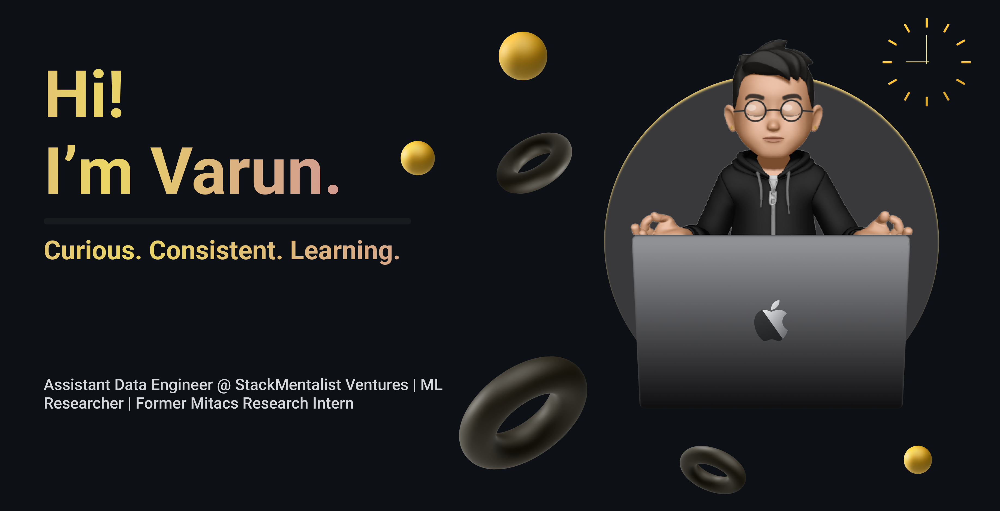

<!--portfolio of my github profile-->

<!--name section-->
<h1 align="center">Hi 👋 I'm Varun</h1>
<!--this is the header-->

<h3 align="center">

</h3>

  
  
  

  

   
  

<!--Mylearnings-->
  
   🔭 Research Intern - MITACS GRI'24, Canada.
  
  
    
   🌱 Currently learning Exploratory data analysis, Machine learning and problem solving with python.
  
  
  
   📫 Reach out *varunmayilvaganan11@gmail.com*.
  
    
   ⚡ In my free time I use to watch, create contents and play badminton.
    
  
   🌟 Fun fact: **Less Tension, More Work!**

 
<h3 align="left">🔥   My Stats :</h3>
  
  

  <!--  -->
  ---
  

  

  

  

  

  

  <!--  -->
  ---

  
<h2>Tools & Languages I code With!</h2>

  

  <!--  -->
  ---
  

  <h2>Frameworks & Databases</h2>

  
 
 

<!--  -->
---
  

<h2>Platforms & Tools</h2>

  

Download My Resume <a href="Varun-Mayilvaganan-Resume.pdf">Click Here!</a>

